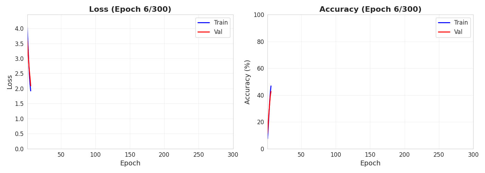

<h1 align="center">
    OOD Detection & Neural Collapse Analysis
</h1>

<p align="center">
    <b>Deep Learning Theory — Practical Work (MVA + ENSTA Paris, CSC_5IA23)</b>
</p>

<p align="center">


<!-- ALL-CONTRIBUTORS-BADGE:START -->

<!-- ALL-CONTRIBUTORS-BADGE:END -->
</p>

<p align="center">


</p>

This project implements and analyzes **Out-of-Distribution (OOD) detection** methods and studies the **Neural Collapse** phenomenon in deep neural networks. We train a ResNet-18 classifier on CIFAR-100 and evaluate six OOD scoring techniques, then study how Neural Collapse properties (NC1–NC5) emerge during training and across network layers.

<p align="center">
  
</p>


## :dart: Overview

The project addresses three main questions:

1. **OOD Detection** — Given a model trained on CIFAR-100 (in-distribution), can we reliably detect samples from SVHN, CIFAR-10, and Textures (out-of-distribution)?
2. **Neural Collapse** — Do the five Neural Collapse properties (NC1–NC5) emerge during the terminal phase of training?
3. **Layer-wise Analysis** — Does Neural Collapse propagate backward from the last layer to earlier layers?

## :package: Project Structure

```
OOD-Detection-Project---CSC_5IA23/
├── README.md
├── report.pdf
├── Sujet_OOD.pdf
├── configs/
│   └── config.yaml                  # Hyperparameters & paths
├── notebooks/
│   ├── 01_training.ipynb            # Q1: Train ResNet-18 on CIFAR-100
│   ├── 02_ood_detection.ipynb       # Q2 & Q5: OOD scoring methods
│   ├── 03_neural_collapse.ipynb     # Q3 & Q4: NC1–NC4 analysis
│   ├── 04_nc5_analysis.ipynb        # Q4: NC5 (ID/OOD orthogonality)
│   └── 05_neural_collapse_earlier_layers.ipynb  # Q6: Layer-wise NC
├── src/
│   ├── models/
│   │   └── resnet.py                # ResNet-18 adapted for CIFAR-100
│   ├── ood_scores/
│   │   ├── output_based/            # MSP, Max Logit, Energy
│   │   ├── distance_based/          # Mahalanobis
│   │   └── feature_based/           # ViM, NECO
│   ├── neural_collapse/
│   │   ├── nc_metrics.py            # NC1–NC4 computation
│   │   ├── nc5.py                   # NC5 orthogonality
│   │   └── nc_earlier_layer.py      # Layer-wise NC analysis
│   ├── data/
│   │   └── datasets.py              # CIFAR-100, SVHN, CIFAR-10, Textures loaders
│   └── utils/
│       ├── training.py              # Trainer class with checkpointing
│       ├── visualization.py         # Plotting utilities
│       └── RF_search.py             # Receptive field hyperparameter search
├── checkpoints/                     # Saved every 25 epochs (not in repo)
└── results/
    ├── figures/
    │   ├── training/
    │   ├── ood_scoring/
    │   └── neural_collapse/
    └── metrics/
```

## :wrench: Architecture Adaptation

The standard ResNet-18 was designed for ImageNet (224×224). We adapted the first convolutional block (`b1`) for CIFAR-100 (32×32) via a receptive field search:

```
BEST CONFIG:
kernel=3, stride=1, padding=1, maxpool=False
Final RF: 109px, Spatial: 4x4
Receptive field ratio (after b1) = 9.38%
```

This keeps the b1 receptive field ratio comparable to the original ImageNet design (~4.91%).

## :gear: Training

| Parameter | Value |
|-----------|-------|
| Optimizer | SGD + Cosine Annealing (lr=0.1) |
| Loss | CrossEntropyLoss |
| Epochs | 300 |
| Checkpoints | Every 25 epochs |
| Validation | 10% of training set |
| Initialization | Kaiming normal (fan-out) |
| Hardware | Google Colab Pro (H100 GPU, ~1h) |

**Terminal Phase of Training (TPT)** was identified at approximately epoch 225.

## :bar_chart: Results

### Model Performance

| Metric | Value |
|--------|-------|
| Test Accuracy | ~76% |
| TPT onset | ~Epoch 225 |

### OOD Detection (Epoch 300)

#### Per-Dataset Results (AUROC ↑ / FPR95 ↓)

| Method | SVHN |  | CIFAR-10 |  | Textures |  |
|--------|:----:|:----:|:--------:|:----:|:--------:|:----:|
|  | AUROC | FPR95 | AUROC | FPR95 | AUROC | FPR95 |
| MSP | 0.81 | 0.52 | 0.79 | **0.57** | 0.79 | 0.58 |
| Max Logit | 0.82 | 0.49 | **0.80** | 0.58 | 0.80 | 0.55 |
| Energy | 0.83 | 0.49 | 0.79 | 0.58 | 0.80 | **0.54** |
| Mahalanobis | 0.76 | 0.59 | 0.79 | 0.61 | 0.79 | 0.67 |
| ViM | 0.83 | 0.50 | 0.77 | 0.58 | 0.72 | 0.64 |
| NECO | **0.88** | **0.45** | 0.69 | 0.82 | **0.85** | 0.63 |

#### Average Across Datasets

| Scorer | AUROC ↑ | FPR95 ↓ |
|--------|---------|---------|
| MSP | 0.795 ± 0.008 | 0.556 ± 0.029 |
| MaxLogit | 0.805 ± 0.012 | 0.540 ± 0.035 |
| **Energy** | **0.807 ± 0.014** | **0.538 ± 0.036** |
| Mahalanobis | 0.779 ± 0.012 | 0.624 ± 0.033 |
| ViM | 0.773 ± 0.043 | 0.574 ± 0.058 |
| **NECO** | **0.807 ± 0.085** | 0.633 ± 0.149 |

### Neural Collapse Metrics (Final Epoch)

| Metric | Value |
|--------|-------|
| NC1 (Within-class collapse) | 5.50 |
| NC2a (Equinorm: CoV of ‖Mc‖) | 0.033 |
| NC2b (Equiangularity: ETF deviation) | 0.058 |
| NC3 (Self-duality: ‖W^T − M‖²) | 0.037 |
| NC4 (NCC disagreement) | ≈ 0.000 |

## :test_tube: Implemented Methods

### OOD Detection Scores

| Category | Method | Description |
|----------|--------|-------------|
| **Output-based** | MSP | Maximum Softmax Probability |
|  | Max Logit | Maximum logit value |
|  | Energy | E(x) = −log Σ exp(f_c(x)) |
| **Distance-based** | Mahalanobis | Min Mahalanobis distance to class means |
| **Feature-based** | ViM | Virtual Logit Matching |
|  | NECO | Neural Collapse-based detection |

### Neural Collapse Properties

| Property | What it measures |
|----------|-----------------|
| **NC1** | Within-class variability collapse |
| **NC2** | Convergence to Simplex ETF (equinorm + equiangularity) |
| **NC3** | Self-duality (classifier weights ≈ class means) |
| **NC4** | Network ≡ Nearest Class Center classifier |
| **NC5** | ID/OOD orthogonality |

## :floppy_disk: Datasets

| Dataset | Role | Samples used |
|---------|------|-------------|
| CIFAR-100 | In-Distribution | 10,000 (test) |
| SVHN | Out-of-Distribution | 2,603 |
| CIFAR-10 | Out-of-Distribution | 1,000 |
| Textures | Out-of-Distribution | 188 |

## :rocket: Usage

### Cloning the repository

```bash
git clone https://github.com/DiegoFleury/OOD-Detection-Project---CSC_5IA23.git
cd OOD-Detection-Project---CSC_5IA23
```

### Requirements

```bash
pip install torch torchvision numpy matplotlib seaborn scikit-learn pyyaml imageio tqdm
```

### Running the notebooks

All notebooks are designed to run on **Google Colab** (Pro recommended for GPU access). Open them sequentially:

```bash
# Q1: Train ResNet-18 on CIFAR-100
jupyter notebook notebooks/01_training.ipynb

# Q2 & Q5: OOD detection scoring (all 6 methods)
jupyter notebook notebooks/02_ood_detection.ipynb

# Q3 & Q4: Neural Collapse NC1–NC4
jupyter notebook notebooks/03_neural_collapse.ipynb

# Q4: Neural Collapse NC5 (ID/OOD orthogonality)
jupyter notebook notebooks/04_nc5_analysis.ipynb

# Q6: Neural Collapse on earlier layers
jupyter notebook notebooks/05_neural_collapse_earlier_layers.ipynb
```

> Checkpoints are saved every 25 epochs and are required for notebooks 02–05. Run notebook 01 first or download pretrained checkpoints.

## :books: References

- Papyan, V., Han, X. Y., & Donoho, D. L. (2020). *Prevalence of Neural Collapse during the Terminal Phase of Deep Learning Training*. PNAS.
- Ben Ammar, S., Belharbi, S., Pedersoli, M., & Granger, E. (2024). *NECO: Neural Collapse Based Out-of-Distribution Detection*. ICLR.
- Chen, T. Q., Rubanova, Y., Bettencourt, J., & Duvenaud, D. (2018). *Neural Ordinary Differential Equations*. NeurIPS.

## :busts_in_silhouette: Contributors

<table>
  <tr>
    <td align="center">
      <a href="https://github.com/DiegoFleury">
        <br/>
        <sub><b>Diego Fleury Correa de Moraes</b></sub>
      </a><br/>
      <a href="https://github.com/DiegoFleury/OOD-Detection-Project---CSC_5IA23/commits?author=DiegoFleury" title="Code">💻</a>
      <a href="#" title="Documentation">📖</a>
    </td>
    <td align="center">
      <a href="https://github.com/sergio-contente">
        <br/>
        <sub><b>Sergio Magalhaes Contente</b></sub>
      </a><br/>
      <a href="https://github.com/DiegoFleury/OOD-Detection-Project---CSC_5IA23/commits?author=sergio-contente" title="Code">💻</a>
      <a href="#" title="Documentation">📖</a>
    </td>
  </tr>
</table>
